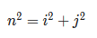

## Exercício 1 - Primos

Escreva a função ```n_primos``` que recebe como argumento um número inteiro maior ou igual a 2 como parâmetro e devolve a quantidade de números primos que existem entre 2 e n (incluindo 2 e, se for o caso, n).

Exemplo:

```ruby
n_primos(2)
```
deve devolver 1

```ruby
n_primos(4)
```
deve devolver 2

```ruby
n_primos(121)
```
deve devolver 30

## Exercício 2 - (Difícil) Soma das hipotenusas

Dizemos que um número é uma ```hipotenusa``` de um triângulo inteiro se existe um triângulo retângulo com lados inteiros cuja hipotenusa é igual a esse número. Em outras palavras, nnn é uma hipotenusa se existem números inteiros iii e jjj tais que:



Escreva uma função ```soma_hipotenusas``` que receba como parâmetro um número inteiro positivo n n n e devolva a soma de todos os inteiros entre 1 e n n n que são comprimento da hipotenusa de algum triângulo retângulo com catetos inteiros.

```Dica1:``` um mesmo número pode ser hipotenusa de vários triângulos, mas deve ser somado apenas uma vez. Uma boa solução para este exercício é fazer um laço de 1 até n n n testando se o número é hipotenusa de algum triângulo e somando em caso afirmativo. Uma solução que dificilmente vai dar certo é fazer um laço construindo triângulos e somando as hipotenusas inteiras encontradas.

```Dica2:``` primeiro faça uma função ```é_hipotenusa``` que diz se um número inteiro é o comprimento da hipotenusa de um triângulo com lados de comprimento inteiro ou não.


```
# Para n = 25, as hipotenusas são:
# 5, 10, 13, 15, 17, 20, 25
# note que cada número deve ser somado apenas uma vez. Assim:
```
```ruby
soma_hipotenusas(25)

```
deve devolver 105

